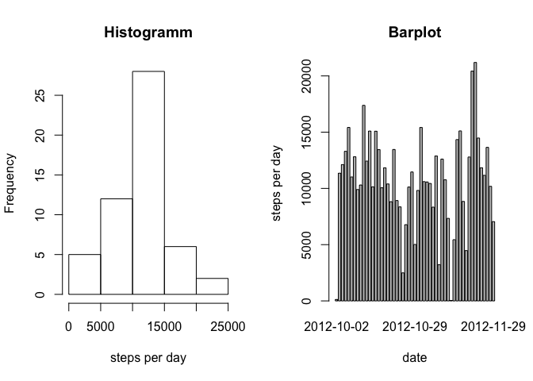
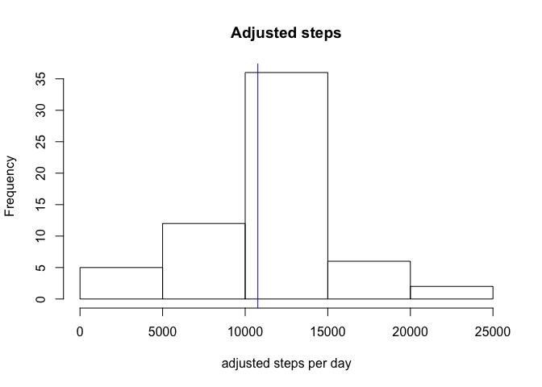

## 1. Activity Monitoring Data

This research makes use of data from a personal activity monitoring device. This device collects data at 5 minute intervals through out the day. The data consists of two months of data from an anonymous individual collected during the months of October and November, 2012 and include the number of steps taken in 5 minute intervals each day.

The variables included in this dataset are:

* `steps`: Number of steps taking in a 5-minute interval
* `date`: The date on which the measurement was taken in YYYY-MM-DD format
* `interval`: Identifier for the 5-minute interval in which measurement was taken

## 2. Downloading and preparing dataset
We should download [data](https://d396qusza40orc.cloudfront.net/repdata%2Fdata%2Factivity.zip) and unzip in working directory.

The dataset is stored in a comma-separated-value (CSV) file and there are a total of 17,568 observations in this dataset.

Then we should load dataset into dataframe and transform column date from "factor" to "date"

```r
df<-read.table("activity.csv", sep = ",", header=TRUE)
df$date<-as.Date(df$date)
```
Now we can take a look at data

For this part of the our research, we ignore the missing values in the dataset. So do not panic if You get NA's in data.

```r
head(df,3)
```

```
##   steps       date interval
## 1    NA 2012-10-01        0
## 2    NA 2012-10-01        5
## 3    NA 2012-10-01       10
```
## 3. What is mean total number of steps taken per day?

###Calculate the total number of steps taken per day
Before we calculate and plot `total number of steps taken per day` - we prepare a new dataset agregated by `date`.

```r
daydf<-aggregate(steps ~ date, df, sum)
head(daydf,3)
```

```
##         date steps
## 1 2012-10-02   126
## 2 2012-10-03 11352
## 3 2012-10-04 12116
```
###Make a histogram and barplot of the total number of steps taken each day 
We can see a difference between `hist()` and `barplot()` plotting system.
Histogramm shows us a distribution of meanings and barplot presents an average activity for each day. 

```r
par(mfrow=c(1,2))
hist(daydf$steps, main = "Histogramm", xlab="steps per day")
barplot(daydf$steps, names.arg = daydf$date, main = "Barplot", xlab="date", ylab="steps per day")
```

<!-- -->

###Calculate the mean and median of the total number of steps taken per day

```r
mean(daydf$steps, na.rm = TRUE)
```

```
## [1] 10766.19
```

```r
median(daydf$steps, na.rm = TRUE)
```

```
## [1] 10765
```

## 4. What is the average daily activity pattern?

To get closer to the solution of the above mentioned question, let's try to make a new dataset with dimensions `intervals` and `steps`. 
Building new dataset we take into accont to use function `mean` during aggegating meanings.
And now we can visulize data and get a first and rough impression about activity timing and peak activity.

```r
intdf<-aggregate(steps~interval, df, mean)
plot(intdf, type="l")
```

<!-- -->

In order to get the exact answer for the question we should undertake very simple manipulation with data.
We just sort our data on `steps` and get first element of dataset.

So now we have an answer which 5-minute interval, on average across all the days in the dataset, contains the maximum number of steps.

```r
intdfsorted<-intdf[order(-intdf$steps),]
intdfsorted[1,1]
```

```
## [1] 835
```

##5. Imputing missing values

Note that there are a number of days/intervals where there are missing values. 
The presence of missing days may introduce bias into some calculations or summaries of the data.

The number of missing values in the dataset is:


```r
sum(is.na(df$steps))
```

```
## [1] 2304
```

Strategy for filling of the missing values in the dataset will be simple. 
We use a previos dataset `intdf` with mean steps for each 5-minute interval.
So we just merge inital dataset `df` with interval dataset by `intervals` and create new column with `adjusted steps`.


```r
df_adj<-merge(df,intdf, by= "interval")
df_adj<-df_adj[order(df_adj$date,df_adj$interval),]
df_adj$steps.Adjusted<-ifelse(is.na(df_adj$steps.x),df_adj$steps.y, df_adj$steps.x)
daydf_adj<-aggregate(steps.Adjusted ~ date, df_adj, sum)
```

That's a histogram of the total number of adjusted steps taken each day.

```r
hist(daydf_adj$steps.Adjusted, xlab="adjusted steps per day", main = "Adjusted steps")
abline(v=mean(daydf_adj$steps.Adjusted), col="blue")
```

<!-- -->

The mean and median total number of adjusted steps taken per day. 

```r
mean(daydf_adj$steps.Adjusted)
```

```
## [1] 10766.19
```

```r
median(daydf_adj$steps.Adjusted)
```

```
## [1] 10766.19
```

The difference is very low.

##6. Working day activity VS. Weekend activity

For this part we create a new factor `wend` variable in the dataset with two levels – “weekday” and “weekend” indicating whether a given date is a weekday or weekend day.


```r
df_adj$weekday<-weekdays(df_adj$date)
df_adj$wend <- as.factor(ifelse(df_adj$weekday %in% c("Saturday","Sunday"), "Weekend", "Weekday"))
finaldf<-df_adj[c(1,5,7)]
finaldf<-aggregate(. ~interval+wend, data=finaldf, sum, na.rm=TRUE)
```

That's the panel plot containing a time series plot of the 5-minute interval (x-axis) and the average number of steps taken, averaged across all weekday days or weekend days (y-axis).


```r
library(lattice)
xyplot(finaldf$steps.Adjusted~finaldf$interval|finaldf$wend, data=finaldf, type="l",  layout = c(1,2),
       main="Weekend Activity vs. Working day Activity", 
       ylab="Average Number of Steps per Day", xlab="Interval")
```

<!-- -->
